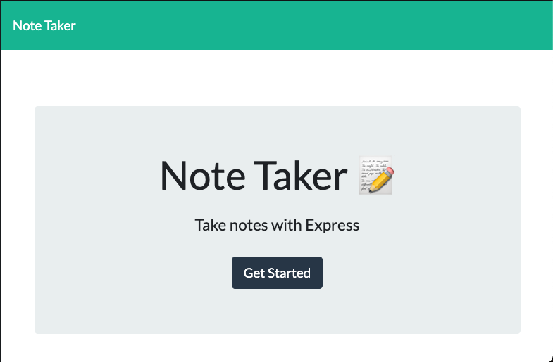
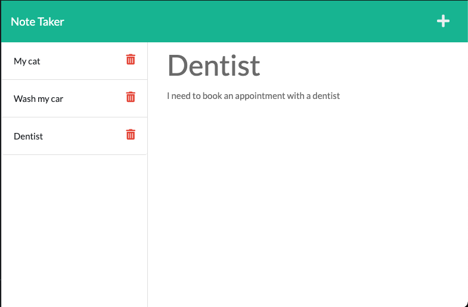

# note-taker

## <h2 id="description"> Description </h2>

A web app that keeps track of all your notes. A user can write and save their own notes. This application will use an Express.js back end and will save and retrieve note data from a JSON file. The application is deployed on Heroku.

### Preview

The end product should resemble the mock-up provided below:

## <h2 id="table-of-contents"> Table of Contents </h2>

- [Description](#description)
- [Installation](#installation)
- [Usage](#usage)
- [License](#license)

## <h2 id="installation"> Installation </h2>
[(Back to top)](#table-of-content)

To use this project, first clone the repo on your device using the commands below:

    git clone https://github.com/Supasiti/note-taker.git

Then install all the required libraries by running the follow command

    npm i 

## <h2 id="usage"> Usage </h2>
[(Back to top)](#table-of-content)

The deployed application can found [here](https://supa-note-taker.herokuapp.com).

## <h2 id="license"> License </h2>
[(Back to top)](#table-of-content)

Licensed under the [MIT](https://opensource.org/licenses/MIT) license.
